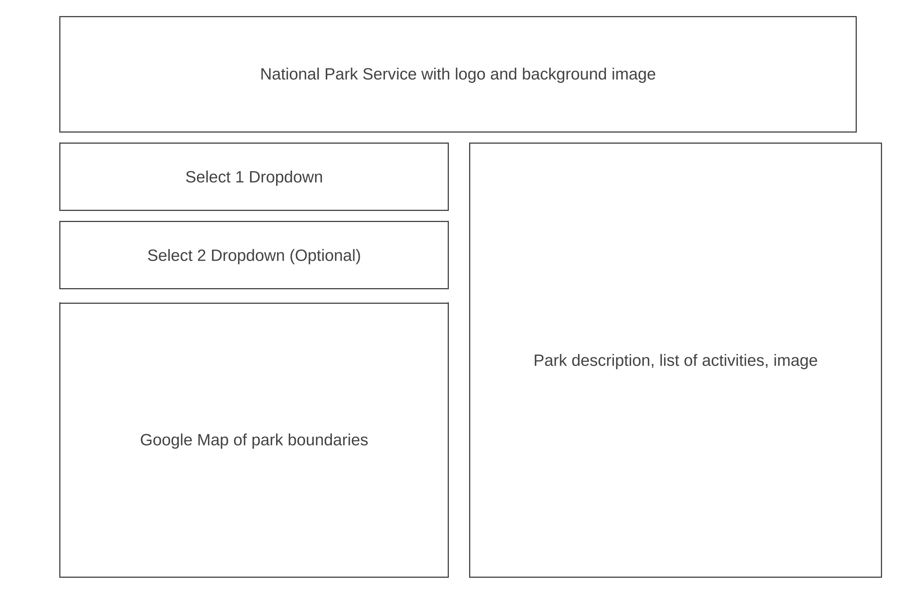
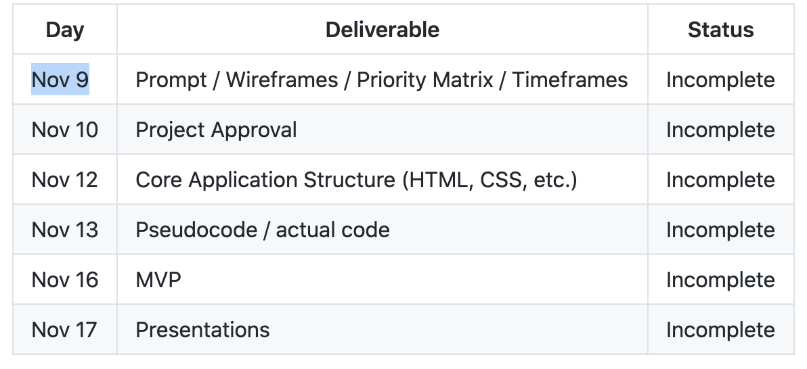
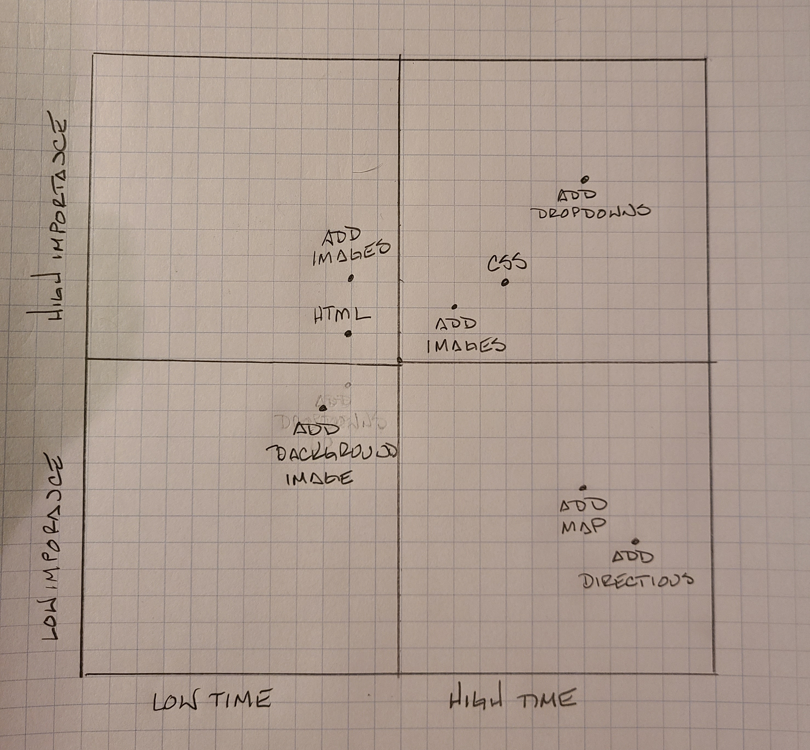

# Project Overview

## Project Name

Plan Your National Park Visit


## Project Description

This web site will assist anyone planning to visit a National Park in the US.  The user will be able to locate a National Park by state or acitivity using drop down lists.  A list of parks will then be returned to the user.  They can click on the park name and a description of the park, a list of activities and an image will be returned. 


## API and Data Sample

I will be using the API provided by the National Parks Service, https://www.nps.gov/subjects/developer/index.htm.  Below if an example of the JSON:
data: [  
{  
id: "6DA17C86-088E-4B4D-B862-7C1BD5CF236B",  
url: "https://www.nps.gov/acad/index.htm",  
fullName: "Acadia National Park",  
parkCode: "acad",  
description: "Acadia National Park protects the natural beauty of the highest rocky headlands along the Atlantic coastline of the United States, an abundance of habitats, and a rich cultural heritage. At 3.5 million visits a year, it's one of the top 10 most-visited national parks in the United States. Visitors enjoy 27 miles of historic motor roads, 158 miles of hiking trails, and 45 miles of carriage roads.",  
latitude: "44.409286",  
longitude: "-68.247501",  
latLong: "lat:44.409286, long:-68.247501",  
activities: [  
{  
id: "09DF0950-D319-4557-A57E-04CD2F63FF42",  
name: "Arts and Culture"  
},  


## Wireframes

Upload images of your wireframes to an image hosting site or add them to an assets folder in your repo and link them here with a description of each specific wireframe.



#### MVP 
By linking the National Parks Service API, the user will be able to access the database  
I'll add one dropdown to select state and one optional dropdown to select activity  
The park name, address and image will display on the page..


#### PostMVP  
I'll have different images of the chosen park cycle on the page  
I'll add a button to get directions  
I'll add a button to get current weather forecast  


## Project Schedule

This schedule will be used to keep track of your progress throughout the week and align with our expectations.  

You are **responsible** for scheduling time with your squad to seek approval for each deliverable by the end of the corresponding day, excluding `Saturday` and `Sunday`.





## Priority Matrix




## Timeframes

Tell us how long you anticipate spending on each area of development. Be sure to consider how many hours a day you plan to be coding and how many days you have available until presentation day. Students usally put in around 40+ hours into their project 1.

Time frames are also key in the development cycle.  You have limited time to code all phases of the game.  Your estimates can then be used to evalute game possibilities based on time needed and the actual time you have before game must be submitted. It's always best to pad the time by a few hours so that you account for the unknown so add and additional hour or two to each component to play it safe. Throughout your project, keep track of your Time Invested and Actual Time and update your README regularly.

| Component           | Priority| Estimated Time | Time Invested| Actual Time|
| --------------------|:--------:|:-------------:|:------------:|:----------:| 
| Write core HTML     | H        |  4hr          |              |            |
| Write core css      | H        |  12hr         |              |            | 
| Write core js       | H        |  8hr          |              |            |
| Add API             | H        |  1hr          |              |            |
| Create dropdowns    | H        |  3hr          |              |            |
| Create buttons      | H        |  3hr          |              |            |
| Add images          | H        |  2hr          |              |            |
| Style images        | H        |  3hr          |              |            |
| Add maps            | L        |  2hr          |              |            |


## Code Snippet

Use this section to include a brief code snippet of functionality that you are proud of and a brief description.  

```
function reverse(string) {
	// here is the code to reverse a string of text
}
```

## Change Log
 Use this section to document what changes were made and the reasoning behind those changes.
